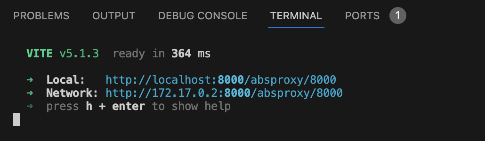
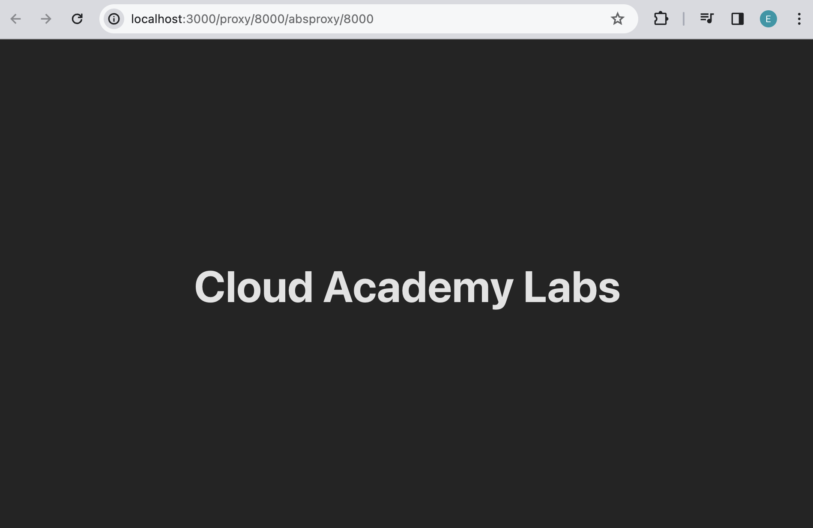
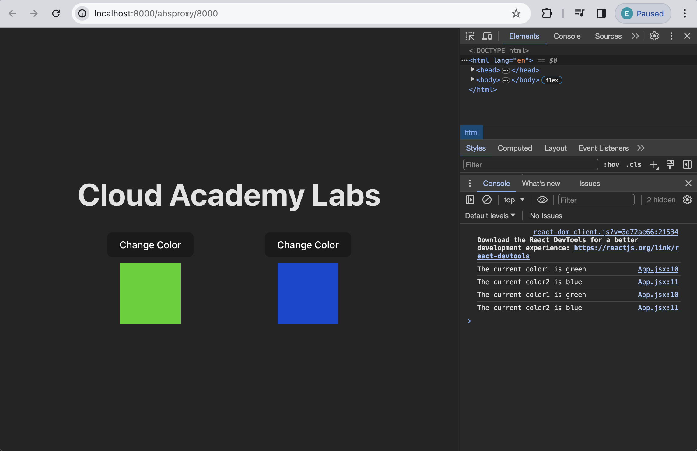
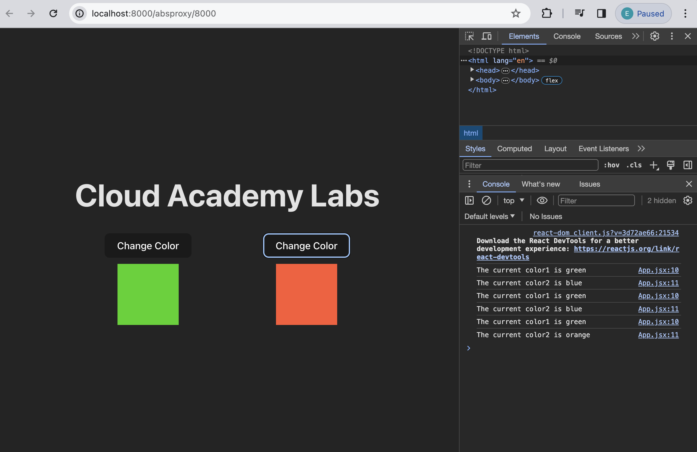
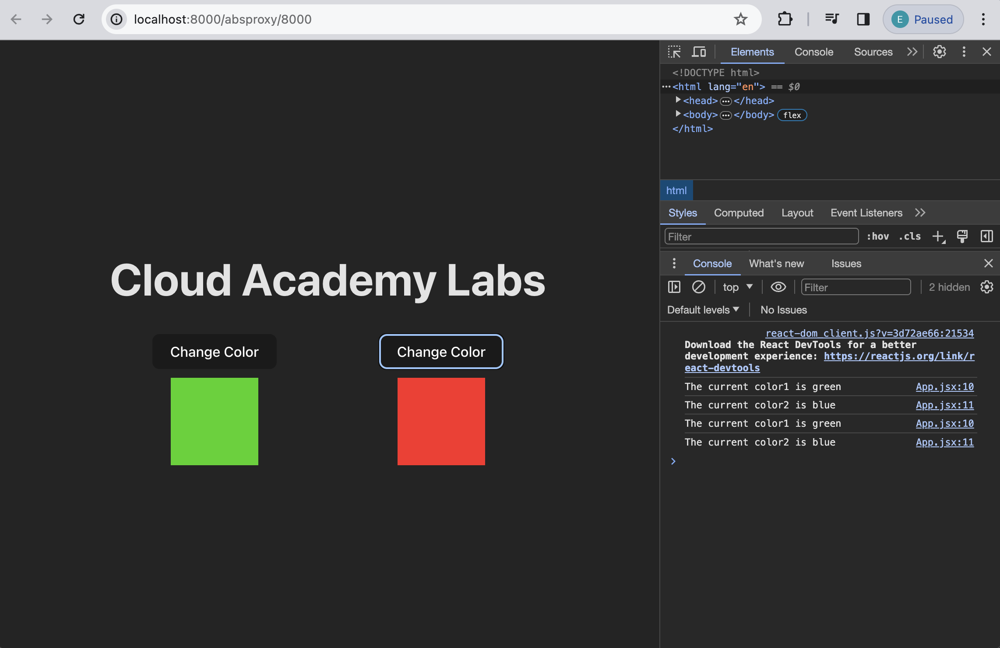
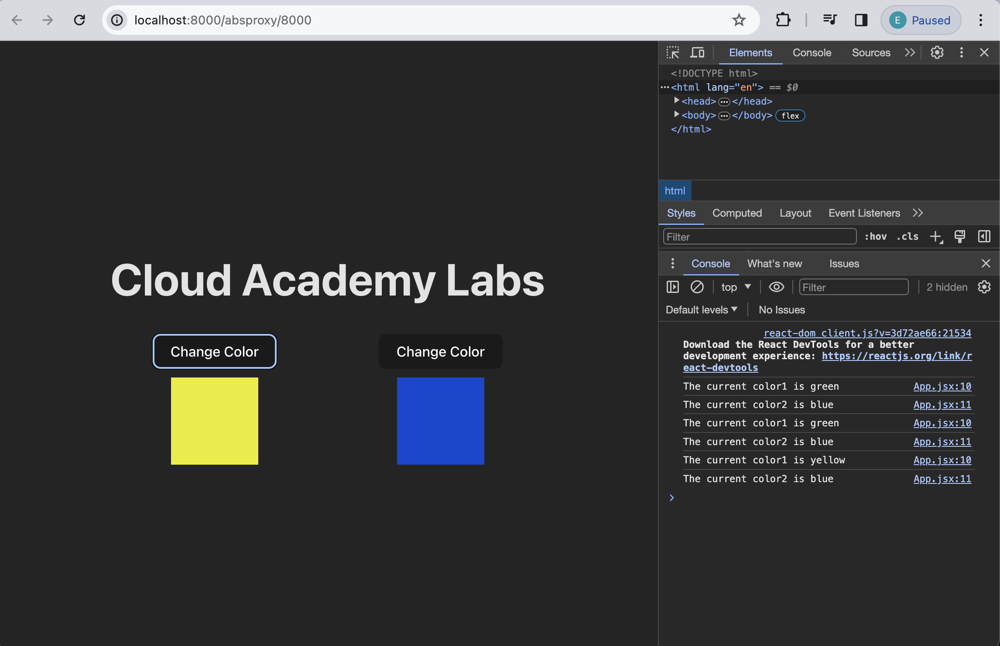
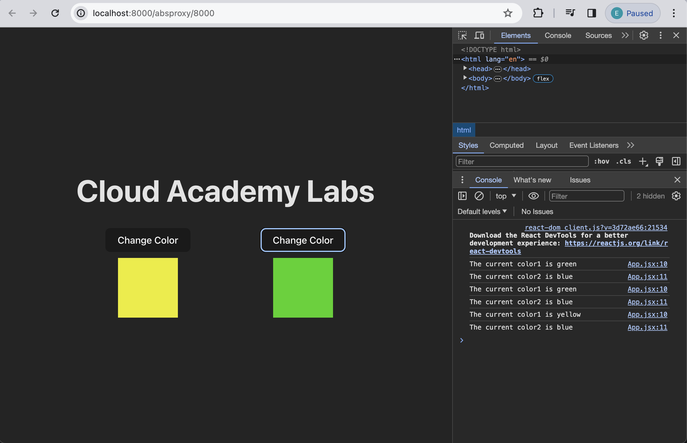

# Template!!! Change it

## Setup 
Before we begin writing code, let's setup the project and install all necesarry packages.
Open a new Terminal window and do the following steps:

1. Go to `calab` directory:
    ```
    cd calab
    ```
2. Install npm packages:
    ```
    npm install
    ```
3. Start the application:
    ```
    npm run dev
    ```
    You should see the development server being started:
    []() 

    If you open the `Local` URL in a new browser tab, you should see the follwoing:
    []()    


## Steps 

### Setup the code

1. Create a new component called `Rectangle` to display color.
    -   Create new folder called `components` in `calabs/src`.
    -   Inside `components` create a new file called `Rectangle.jsx`
    -   Inside `Rectangle.jsx` create a `<div>` that would display color passed in as a prop.
        ```
        function Rectangle({color}) {
            return <div
            style={{
            margin: '0 auto',
            width: '100px',
            height: '100px',
            backgroundColor: color,
            marginTop: '10px',
            }}
        ></div>;
        }
        export default Rectangle
        ```

2. Create statefull values of color1 and color2 by using react hook to track the state of each color.
    -   Open `calabs/src/App.jsx` file.
    -   Import React State hook.
        ```
        import React, { useState } from 'react';
        ```
    - Inside App() function just before it's return statement, declare two variables and their update functions using state hook. Set default values for both.
        ```
        const [color1, setColor1] = useState('green');
        const [color2, setColor2] = useState('blue');
        ```

3. Declare color map color and it's corresponding Hex value.
    -   Inside App() function just after state variables, create a map that contains list of colors and their corresponding Hex values.
        ```
        const colorMap = new Map([
            ['orange','#FF5733'],
            ['yellow','#ECEC04'],
            ['green','#39D303'],
            ['blue','#0348D3'],
            ['pink','#FF27F2'],
            ['red','#FF2727']
        ]);
        ```

4. Create a helper function to pick a random collor from the colors map.
    -   Inside App() function just after colors map, create a function called `getRandomColor()`. The following function should perform the following tasks:
        -   Get array of keys from colorMap
        -   Randomly pick one of the indexes
        -   Return random color
            ```
            const getRandomColor = () => {
                // Get array of keys from colorMap
                let colors = Array.from(colorMap.keys());
                // Randomly pick one of the indexes
                const randomIndex = Math.floor(Math.random() * colors.length);
                // return random color
                return colors[randomIndex];
            };
            ```

5. Render 2 Rectagles and their buttons side by side.
    -   Inside App() function, just after the `<h1>` element, insert new `<div>` element. 
    -   Style the div we just created.
        -   Open `App.css` file
        -   Declare new CSS class called `grid-container` to display children elements of this div as a grid.
            ```
            .grid-container {
                display: grid;
                grid-template-columns: 1fr 1fr;
                grid-gap: 20px;
            }
            ```
        -   Define a class name for the `<div>` element
            ```
            <div className='grid-container'>
            ```
    - Inside `<div>` element, create two other `<div>` elements
        ```
        <div className='grid-container'>
            <div>
            
            </div>
            <div>

            </div>
        </div>
        ```
    -   Inside first `<div>`, Render a `<button>` and a `<Rectangle>`. 
        -   Render a `<button>` that calls setColor1 state setter with the random color received from getRandomColor() function when is clicked. 
            ```
            <button onClick={()=>{setColor1(getRandomColor())}}>Change Color</button>
            ```
        -   Render a `<Rectangle>` and pass in the color hex value.
            ```
            <Rectangle color={colorMap.get(color1)}></Rectangle>
            ```
    -   Inside second `<div>`, Render a `<button>` and a `<Rectangle>`. 
        -   Render a `<button>` that calls setColor2 state setter with the random color received from getRandomColor() function when is clicked. 
            ```
            <button onClick={()=>{setColor2(getRandomColor())}}>Change Color</button>
            ```
        -   Render a `<Rectangle>` and pass in the color hex value.
            ```
            <Rectangle color={colorMap.get(color2)}></Rectangle>
            ```

### Introduce the Effect Hook

1. Implement Effect React hook.
    -  At the top of `App.jsx`,  just after useState, type comma useEffect to get access to useEffect hook.
    ```
    import React, { useState, useEffect } from 'react';
    ```

    -   After the state implementations, let's type useEffect(). Now type an arrow function inside of the parentheses, and inside the arrow function, console.log using a template literal the current color for both `color1` and `color2`.
        ```
        useEffect(()=>{
            console.log(`The current color1 is ${color1}`)
            console.log(`The current color2 is ${color2}`)
        });
        ```
    Once you open React development server, and open it's console, you should see the following:
        []()
    - If you change the color of any of the Rectagles by click on any of the buttons, you will see that the useEffect hook will print the current colors of both Rectangles again.
        []()


2. Setup React Effect hook's dependency array.
    -    Configure useEffect to only execute once after the initial render.
        -   Inside useEffect hook, after the callback function, insert an empty array. 
            ```
            useEffect(()=>{
                console.log(`The current color1 is ${color1}`)
                console.log(`The current color2 is ${color2}`)
            }, []);
            ```
        
    If you change the color of any of the Rectagles by click on any of the buttons, you will see that the useEffect will not print the updated collors anymore.
    []()

3.  Add a reactive value to the dependency array. 
    -   Make useEffect to trigger when only the color1 is updated. Add `color1` into the dependency array.
    ```
    useEffect(()=>{
        console.log(`The current color1 is ${color1}`)
        console.log(`The current color2 is ${color2}`)
    }, [color1]);
    ```
     If you change the color of the Rectagles on left hand side by click on the button just above it, you will see that the useEffect will  print the updated colors.
    []()

    However, if you change the color of the Rectagles on the right hand side by click on the button just above it, you will see that the useEffect won't log anything.
    []()

4. The cleanup function 
    -   To print any of the values before they are changed, inside useEffect hook's callback function type in return with an arrow function. Log the previous values.
        ```
        return () => {
            console.log(`The previous color1 is ${color1}`)
            console.log(`The previous color2 is ${color2}`)
        };
        ```
    If you change the color of the Rectagles on left hand side by click on the button just above it, you will see that the useEffect will  print the updated colors and their previous values before the change.
    []()


